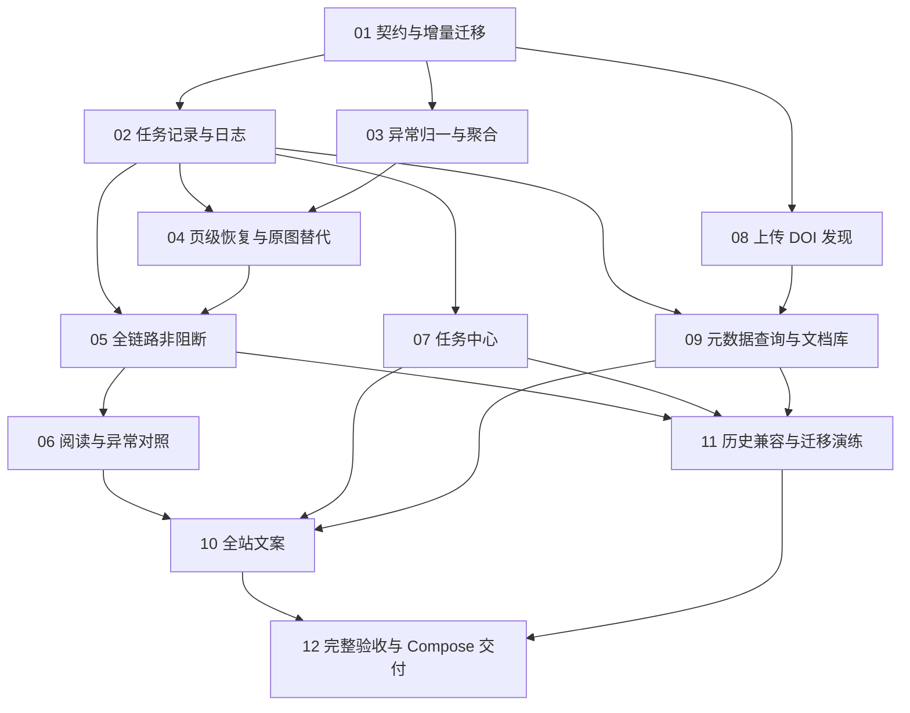

# 非阻断翻译、任务记录与 DOI 元数据 · 执行计划

日期：2026-09-09。状态：**NB-P01–P12 已完成并交付正式 8080 实例**。独立 Compose、受控 Provider、三种真实本地 CPU、公开 DOI、生产备份升级与整栈冷重启均有本轮证据；真实付费 Provider 未获预算/外发授权，按本计划单独标注 NOT RUN。详见[交付验收](../../.agent/notes/nonblocking-20260909-acceptance.md)。

需求以 [Spec](nonblocking-workflow-spec.md) 为准；任务状态与依赖登记在 [nonblocking-workflow-backlog.json](../contracts/nonblocking-workflow-backlog.json)。完成项均附本轮独立验收证据，不沿用旧镜像报告。

## 1. 交付顺序

1. **基础契约与任务留痕**：先定义状态、异常、部分结果、时间和日志，再接入各执行入口。后续解析恢复、翻译与 DOI 查询都使用同一套任务记录。
2. **自动恢复与全链路非阻断**：建立页级异常，补全恢复与原图替代，再移除来源、翻译、封存、发布和导出的内容质量限制。
3. **阅读与任务界面**：让译文成为主界面，异常集中展示；任务列表能看见实际模型、运行时间和日志。
4. **DOI 与文档库元数据**：上传检查阶段发现 DOI，后台查询、匹配、缓存，成功后替换文件名显示。
5. **文案、兼容与最终验收**：统一所有入口，验证旧任务/旧文档和故障场景，再更新 Compose 服务。

依赖允许 NB-P03 与 NB-P02、NB-P08 与 NB-P04 在实现层面独立推进；当前执行方式默认单个 agent 按依赖处理，不因此自动创建并行 agent。

## 2. 工作包与验收

### NB-P01 · 统一契约、状态和增量数据迁移

**依赖：无。对应：NB-R01/R05/R07。**

- 盘点 `can_translate`、`qa.valid`、`QUALITY_BLOCKED`、`SOURCE_PARSE_REVIEW`、`QA_STALE`、必译段落/保护原子检查以及前端所有禁止条件，建立“现有检查 → 新提示/安全降级行为”清单。
- 定义执行状态、质量提示、部分结果/原图保留单元、模型快照、任务时间和日志结构。明确 UI/领域/API/IR/模板分别承担的责任。
- 扩展 Job/Task/Attempt 或新增阶段表、日志记录和文档元数据结构；持久化原始文件名、标题来源与用户改名标志。使用增量 PostgreSQL migration，新增字段先允许空值。
- 同步状态枚举、API 类型及序列化、契约 schema，定义旧字段兼容策略，禁止只改前端或放宽 validator 后留下无法渲染的数据。

**主要模块：** `src/packages/domain/models.py`、`src/packages/domain/db.py`、`packages/domain/migrations/`、`docs/contracts/workflow-states.json`、`res/schemas/document-ir-v3.schema.json`、`docs/shared/`、`src/apps/web/src/types.ts`。

**验收 NB-AT01–02：** 迁移前后旧对象和不可变历史可读取；内容质量状态与执行许可解耦，接口契约能表达部分结果与未执行检查；错误 AST/路径仍不能进入渲染器。

### NB-P02 · 所有任务的执行信息与持久化日志

**依赖：NB-P01。对应：NB-R05。**

- 在创建、claim、每次尝试、完成、失败、取消、暂停/恢复、租约回收处补全时间和事件，统一所有 worker 出口。
- 记录选定配置与实际执行身份；解析写模型修订、CPU/线程和冻结 timeout，翻译写 API 协议/model/config revision。自动检查/恢复/元数据查询采用同样契约。
- parser 加入有界进度/事件 spool，worker 持久接收并去重；常规日志不依赖容器 stdout。长任务可看到“正在加载模型 / 正在解析第 N 页”等阶段。
- 增加分页/过滤日志 API、稳定事件游标及下载脱敏日志；接入备份和持久化留存，不被 spool 清理删除。

**主要模块：** `src/packages/jobs/queue.py`、`src/workers/main.py`、`src/workers/parser/main.py`、`src/packages/parsers/spool.py`、`src/packages/translation/execution.py`、`src/apps/api/workflow.py`、`packages/maintenance/`。

**验收 NB-AT03–04：** 每类任务成功/失败/取消/重试有正确起止时间和实际模型；重启和 spool 清理后历史仍可查；设置变更不改历史模型；无模型与历史未知字段正确显示；日志无 key/鉴权头/全文。

### NB-P03 · 统一异常及按页聚合

**依赖：NB-P01。对应：NB-R01/R02/R03。**

- 统一来源覆盖、VLM 差异、数字/公式/表格/代码以及翻译检查的 issue 结构，区分重要性与是否可执行。
- 页级遗漏先聚合；区域级问题合并相邻范围并去重，保留原始诊断证据供展开查看。低影响问题默认折叠，不生成审批状态。
- 修复 preflight API `unresolved` 与前端 `p.issues` 不一致；纠正页级 ready 显示为“待发布”和任务错误原因缺失。
- 评估 PDF 字体映射、软连字符、公式上标/下标与比较算法产生的误报，归一化只用于比较，不能为了消除差异改写真实数值。

**主要模块：** `src/packages/parsers/pdf_docling.py`、`src/packages/parsers/fidelity.py`、`src/packages/editorial/drafts.py`、`src/apps/api/workflow.py`、`src/apps/web/src/components.tsx`、`src/apps/web/src/features/editor-quality.tsx`。

**验收 NB-AT05–06：** 一个空页引出的上百区域问题聚合成一项；展示数量与口径一致；没有问题、尚未检查、检查失败分别显示；仅脚注/断词差异不能阻止任何后续阶段。

### NB-P04 · 缺页/大段恢复与复杂内容原图替代

**依赖：NB-P02/NB-P03。对应：NB-R02/R03/R04。**

- 先增加缺页、双栏缺一栏、图注重复、扫描页无原生文字及公式/表格误识别的受控样本。
- 使用原生页文字和几何证据恢复缺失正文、确定的续接与机械差异；对无法确定的页做有限次数局部解析/OCR。复用离线 CPU 模型，不新增在线模型依赖。
- 每次恢复保留前后内容、规则/实际模型、页码、耗时和结果；遵守已冻结总 timeout，避免恢复无限延长任务。
- 无法恢复时生成带页码的原页/区域替代单元并继续；公式/代码默认图像保留，表格在结构化和原图之间明确表示，相关数字提供对照定位。

**主要模块：** `src/packages/parsers/inspect.py`、`src/packages/parsers/pdf_docling.py`、`src/packages/parsers/pdf_paddleocr.py`、`src/packages/parsers/fidelity.py`、`packages/source_revisions/`、IR schema 与 validator。

**验收 NB-AT07–08：** 复现并覆盖 PipeDream 第 5 页缺栏、第 14 页缺页、第 11 页表格配置错字这些类型；恢复有界、模型记录真实、失败保留原图且继续；原始 PDF/旧来源不被覆盖。

### NB-P05 · 翻译、检查、封存、发布与导出全部非阻断

**依赖：NB-P02/NB-P04。对应：NB-R01/R03。**

- 接通上传/任务入口到解析、检查恢复、翻译的自动推进，移除来源全文必选确认；有授权快照时不在预检中再停一次。
- 改造 source seal、translation unit validation、draft QA、source/translation validation、publish/rebuild/export；质量问题保留为警告或部分结果，不再抛出审批型错误。
- 处理模型返回内容不完整、保护原子不一致、超时/失败的局部单元：保留可用译文，未完成部分用有标签的原文/原图代替；不能伪造完成。未知付费单元不自动重发。
- 自动运行/刷新检查；报告过期或检查器故障本身不阻止阅读/发布。后台与前端使用同一语义，API 直调和 UI 不产生不同结果。
- 旧 `needs_review` 结果提供继续生成的入口，不要求手工清空告警，也不因升级自动触发历史付费任务。

**主要模块：** `src/apps/api/library.py`、`src/apps/api/workflow.py`、`src/apps/api/sources.py`、`src/apps/api/editorial.py`、`packages/translation/`、`src/packages/editorial/drafts.py`、`packages/ir/`、`packages/publisher/`、worker。

**验收 NB-AT09–10：** 缺段/数字/公式/表格差异、未确认或检查失败均可继续生成、封存、发布、导出；失败单元可见且其他单元正常完成；无安全渲染绕过或重复未知付费请求。

### NB-P06 · 以阅读为中心的异常与原 PDF 对照

**依赖：NB-P05。对应：NB-R01/R04。**

- 将强制预检工作台改成可选解析结果页；默认进入可阅读结果，集中展示少量重要异常。
- 数字、公式、表格、代码都能点开原图对照；不确定定位显示整页。按页/重要性筛选并直接跳转，低影响提示默认收起。
- 手动调整解析、来源修订及局部重译继续提供，但不放在主流程中作为必经步骤；保留未保存编辑状态。
- 同步阅读模板、图片资源和单文件/打包导出，让离线阅读也能看到对照与未完成标记；不修改已发布快照和旧 reader-v1 CSS。

**主要模块：** `src/apps/web/src/features/workflow.tsx`、`import-corrections.tsx`、`editor.tsx`、`editor-quality.tsx`、`src/apps/web/src/components.tsx`、`packages/templates/`、`packages/publisher/`。

**验收 NB-AT11–12：** 桌面/手机可直接读译文，异常点击定位、原图加载、返回阅读均正常；无需勾选校对；部分结果、错误标记和图像对照在导出中保留。

### NB-P07 · 任务中心与全部历史详情

**依赖：NB-P02。对应：NB-R05。**

- 列表展示文档、任务类型、解析/API 模型、状态和时间；详情展示起止、排队/执行时长、冻结配置、父子任务和每次尝试。
- 增加完整历史分页、按类型/状态筛选、日志流和脱敏日志下载。已完成带提示的任务不混入“等待人工处理”。
- 在解析结果页同时显示实际解析方案，直接区分 Docling / Granite / Paddle；不可根据当前设置猜测旧任务模型。
- 迁移前历史显示可证实字段，对未知信息使用明确文案；删除文档后保留技术任务回执。

**主要模块：** `src/apps/api/workflow.py`、`src/apps/web/src/features/job-list.tsx`、`job-presentation.ts`、`workflow.tsx`、`src/apps/web/src/types.ts`。

**验收 NB-AT13–14：** 所有任务类型和终态可查，跨刷新/重启历史信息不变；取消/重试/长任务时间正确，Granite 不再被误认为 Paddle；日志浏览无卡顿、无秘密信息。

### NB-P08 · 上传阶段发现 DOI

**依赖：NB-P01。对应：NB-R07。**

- 从 XMP/PDF 文档信息、前页文本与 DOI 链接提取候选，规范化并保留位置证据；已有 OCR 结果可以补充，不等待全篇 VLM。
- 区分本篇 DOI 与参考文献 DOI；对多候选、尾随标点、括号、换行、编码和前缀建立测试。
- 将候选绑定 Upload / SourceAsset；上传前后异步生命周期一致，导入重试幂等。没有明确 DOI 不推断另一篇文献。

**主要模块：** `src/packages/parsers/inspect.py`、拟新增 `packages/metadata/doi.py`、上传/导入 API、worker。

**验收 NB-AT15–16：** 单 DOI、多 DOI、只有引用 DOI、无 DOI、扫描件、跨行 DOI 均有明确结果；误判不替换标题，解析/上传不因发现失败而阻断。

### NB-P09 · 元数据查询、匹配和文档库显示

**依赖：NB-P02/NB-P08。对应：NB-R05/R07。**

- 实现 DOI `/metadata` 与 Crossref 适配、匹配检查、缓存、限时/重试、服务来源记录，作为独立任务执行。
- 规范化标题、作者、发表日期、刊物/会议及 DOI 等字段；服务响应中的富文本按安全文本处理。
- 成功且匹配时显示元数据标题与作者/年份/刊物；查询未完成/失败/歧义保持当前文件名逻辑。保留原文件名和用户改名优先级。
- 增加元数据详情/可选刷新；处理查询在 import 前完成、用户改名、换源 PDF、删除和重复上传时的并发。

**主要模块：** 拟新增 `packages/metadata/`、`src/packages/domain/models.py`、`src/apps/api/library.py`、`src/workers/main.py`、文档库/文档详情/任务列表组件、检索索引。

**验收 NB-AT17–18：** 真实公开 DOI 返回正确标题/作者，失败/404/429/超时均不影响主流程；错误文献不会套用；异步更新不覆盖用户标题或更换后的文档；不把 PDF/正文发给元数据服务。

### NB-P10 · 全站 UI 文案与语义审查

**依赖：NB-P06/NB-P07/NB-P09。对应：NB-R06。**

- 逐页建立“现有文案 → 新文案 → 状态含义”的清单，覆盖上传、文档库、解析、阅读、任务、设置、编辑、错误与导出。
- 移除必需人工校对、质量通过才可阅读等旧文案；把内部标识放到技术详情，保留对用户有用的实际模型和时间。
- 检查空值、历史信息不足、局部失败、未检测到 DOI 等状态，避免误称“无问题”“已验证”“待发布”。

**验收 NB-AT19–20：** 页面显示与后端状态一致；无未翻译的内部枚举/undefined；错误说明指出当前结果及可选下一步，不要求无意义的确认。

### NB-P11 · 遗留数据、任务与升级演练

**依赖：NB-P05/NB-P07/NB-P09。对应：NB-R01/R05/R07。**

- 演练新字段 migration、旧任务信息回填与日志归档；不能证明的时间/模型不补猜值。
- 旧来源/译文/发布快照保留。旧质量报告作为历史报告，新的查看和后续执行采用新政策；继续生成时创建新的执行记录。
- 旧任务不会因升级自动重译/重发；旧 DOI 空值保持当前标题。用户自定义标题、Provider 配置、密钥、语言及已冻结 timeout 不被覆盖。
- 覆盖删除回执、备份恢复、保留策略和中断恢复；明确应用回滚与数据库前向迁移兼容边界。

**验收 NB-AT21–22：** 从当前数据库版本升级与恢复可重复；旧产物原样可读、日志可查、无意外联网/付费任务或模型配置改变。

### NB-P12 · 完整验收与 Compose 交付

**依赖：NB-P10/NB-P11。对应：全部要求。**

- 在独立 PostgreSQL 和 Compose 测试环境验证完整上传 → 解析 → 恢复 → 翻译 → 异常 → 阅读/发布/导出链路；覆盖三种本地 CPU 解析方案。
- 用受控 Provider 验证所有非阻断状态与局部失败行为；真实付费 Provider 测试只在明确预算/外发授权范围内执行，未执行时单独标注，不把 fake 测试写成真实模型验收。
- 元数据接口使用公开合成/公开论文 DOI 做实际只读请求，同时用 mock 覆盖限流、超时、错配；不把用户整份 PDF 外发做测试。
- 浏览器验证桌面/手机、直接进入阅读、原图对照、任务日志、真实模型标签、元数据成功/失败展示及无秘密信息泄露。
- 完成备份和迁移演练后，在无活动任务时同步更新 app/worker/parser；验证健康、当前镜像、设置保留、历史可读和冷重启。所有证据写本轮独立 `.agent/tmp/` 目录。

**验收 NB-AT23–24：** 七项用户要求端到端通过；最终代码/镜像和证据对应，失败/未执行项目如实记录。设计文件、单元测试或旧镜像记录不能单独代表交付完成。

## 3. 关键取舍与执行约定

- 不增加默认开启的“严格模式”来重新阻止生成；人工核对始终可选。执行故障与内容质量异常分开记录。
- 恢复先做证据明确的修复，再做有界局部识别；不依靠翻译模型改写来源来消除告警。
- DOI 查询默认自动、异步、只传 DOI；失败继续文件名。元数据优先接口、超时和缓存默认见 Spec，属于可直接实施的工程选择，不等待额外确认。
- 任务记录优先于新增后台动作，使首次恢复/DOI 查询也能查到实际运行证据。
- 不给未验证的速度/工作日保证；按工作包输出和验收推进。一个工作包完成后更新 backlog 状态、验证命令与证据路径。
- 实施前读取最新树和运行状态；本轮计划不会自动启动服务更新或历史任务。若后续用户要求开始，按 NB-P01 → NB-P02 → NB-P03 → NB-P04 → NB-P05 → NB-P06 → NB-P07 → NB-P08 → NB-P09 → NB-P10 → NB-P11 → NB-P12 的默认顺序执行。

## 4. 文档与验收注册策略

目前旧 acceptance harness 对 M0–M2 要求/测试/工作包数量有固定断言。NB backlog 单独登记，避免计划阶段直接追加导致旧 harness 无条件失败或把旧退出门改为通过。实施 NB-P01/NB-P12 时，为 NB 验收接入独立登记和报告，再决定是否统一扩展全局 registry；历史证据仍按原版本解释。

计划阶段的完成条件为七项要求映射、无环依赖和清楚标注待实施；用户随后要求开始并完成全部任务。本轮实现及运行验收已完成，以 NB backlog、独立 `nb-acceptance-report.json` 和交付验收记录为准，不把历史 M0–M2 报告改写为当前认证。
