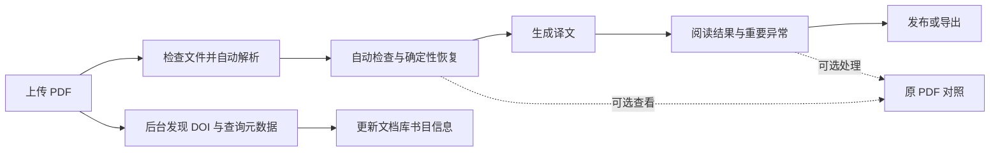

# 非阻断翻译、任务记录与 DOI 元数据 · Spec

日期：2026-09-09。状态：**NB-P01–P12 已实现并交付**。本文件定义 NB 产品行为；正式 8080/schema 12 的实际验收、已执行范围和真实付费 Provider NOT RUN 边界见[本轮交付记录](../../.agent/notes/nonblocking-20260909-acceptance.md)及 backlog。

实施计划见 [Plan](nonblocking-workflow-plan.md)，可执行任务登记见 [backlog](../../contracts/nonblocking-workflow-backlog.json)。本轮采用独立 NB 编号，不改写 M0–M2 的历史验收结果。

## 1. 用户要求与优先级

| 编号 | 必须实现的行为 |
|---|---|
| NB-R01 | 自动解析 → 自动检查和可确定的修复 → 生成译文 → 集中展示重要异常；**所有内容质量异常均 non-blocking**。 |
| NB-R02 | 缺页、大片正文遗漏按页合并，系统先尝试恢复，不要求用户逐行补录。 |
| NB-R03 | 断词、排版差异、作者脚注符号等低影响问题不阻止阅读。 |
| NB-R04 | 数字、公式、表格、代码等复杂内容提供原 PDF 图像对照。 |
| NB-R05 | 所有任务保留并显示类型、实际 API / 提取模型、开始和结束时间、时长、日志等信息。 |
| NB-R06 | 核对全站 UI 文本，优化不自然、繁杂和面向实现细节的表达。 |
| NB-R07 | 上传 PDF 时提取 DOI，调用 DOI Citation Formatter 或 Crossref 获取元数据；成功后文档库展示元数据，未成功则保持现有文件名展示。 |

NB-R01 明确覆盖旧文档中“来源覆盖失败、数字/保护原子差异、缺段、公式或表格差异必须修复后才能翻译、封存、发布或导出”的产品规则。不得仅把按钮解禁，后台仍返回 `SOURCE_PARSE_REVIEW` / `QUALITY_BLOCKED`；不得把“重要异常”换个名字后继续设为人工审批条件。

内容检查继续运行并保留证据，但结果不再决定用户能否获得已有内容的译文。未校对、检查尚未完成、报告过期或检查器失败均不要求人工确认；检查可自动补做，界面如实标注状态。

“非阻断”不表示伪造执行成功。损坏/加密且无法读取的 PDF、不可用的 API、用户取消、数据库冲突、无可用输入等执行条件仍按实际结果处理；有可用页面或单元时尽量形成部分结果。密钥不外泄、未知付费结果不自动重发、不可变历史及 fence/CAS 继续保护真实操作。这些不是内容质量门禁。

## 2. 实施前现状与本轮回归依据

本节保留 2026-09-09 实施前观察，不代表下述问题在交付版本中仍然存在。

- 当前来源预检和确认在 `apps/api/workflow.py` 依据 `coverage.can_translate` / `unresolved` 阻止后续执行；来源封存也有同样条件。
- 译文执行与封存在 `packages/translation/execution.py`、`packages/editorial/drafts.py` 等处仍依据 QA 有效性暂停或拒绝操作。需要覆盖完整后端调用链、前端按钮和导出路径。
- 当前预检前端将 `p.issues` 传给问题列表，实际接口返回 `unresolved`，会同时出现“297 条未解”和“当前未返回问题”。预检页也未清楚标出所用解析方案。
- 实际抽查草稿 `srcdraft_dbc15303d3dc4ab29ce100e85e973eac` 是 **Granite Docling 258M**，不是 Paddle。14 页 / 257 块 / 297 条提示；第 14 页无解析块贡献 174 条提示，第 5 页左栏正文遗漏，第 11 页表格 `9-5-1-1` 被提取为 `9.5-1-1`。这些是回归场景，不把此样本当作 Paddle 性能证据。
- Job / Task / Attempt / Event 已存在，但任务接口主要展示创建时间和状态快照，缺少完整实际模型身份、阶段时间、结束时间和可用日志。任务标题目前从实时文档信息派生，不能据此证明历史任务用了什么配置。
- 上传记录保存文件名；文档和源资产尚无 DOI 发现、解析状态和规范化书目信息契约。

本地检查证据位于 `.agent/tmp/preflight-review-20260909-6ca82ed1/`。历史文件只读；回归测试使用独立、受控样本。

## 3. 新流程与状态

### 自动推进

- 上传时选定解析方案、目标语言及是否翻译；默认执行用户选择的完整流程。解析方案、超时、翻译配置、目标语言在任务创建时快照化。
- 已有有效的外发授权覆盖该文档和所选目的地时，从解析到翻译自动推进，不再经过“全文已核对”的确认页。需要新的外发授权时在上传/启动任务入口一次性收集，不在质量阶段重复询问。
- API 尚未配置或用户暂停外发时，先完成本地解析和可阅读源文；显示具体执行状态，而不是“需要校对”。非阻断需求不用于擅自调用未授权的付费服务。
- 来源语言自动判断；不确定时显示“自动识别”及提示，允许翻译阶段依据上下文处理，不用 `und` 或人工语言选择阻止已有内容生成。用户指定语言优先。
- 新流程默认生成可阅读结果并自动完成用户选择的发布/导出；现有手动发布选择可保留为用户主动控制，不由质量提示强迫切换。

### 执行状态与质量状态分开

- 执行状态描述正在做什么，以及成功、部分完成、失败、取消、等待配置等实际情况；质量提示不是 `needs_review` 阻塞态。
- 建议终态：`succeeded`、`completed_with_warnings`、`partially_completed`、`failed`、`cancelled`；具体内部枚举须在 NB-P01 连同所有消费者统一确认。
- 已完成并带提示的任务不列为“等待处理”或自动重试对象。部分失败不丢弃已完成译文；不能确认是否收到付费响应的单元维持未知状态，不自动重发。
- 未得到可靠译文的段落保留明确标注的原文或原图，不能把原文复制到译文列后冒充“已翻译”。

## 4. 异常聚合与自动恢复

### 异常契约

统一来源和译文异常：稳定 ID、阶段、类别、重要性（重要/一般/提示）、页码、区块范围、原因、证据引用、恢复动作和结果、可选处理状态。**重要性不控制流程权限**。建议统一返回 `issues`，旧 `unresolved` / `can_translate` 在兼容期保留但不再被用作内容质量授权条件。

界面默认按文档 → 页 → 问题聚合，展示重要问题数量而非字形区域总数。保留原始诊断数量供详情查看；一个缺页只显示一项“第 14 页文字未完整提取”，而不是 174 个逐行操作入口。相关的缺字、逆向字符比较和数字差异去重或归入同一范围。

### 有限、自动、可追溯的恢复

1. 先识别页面是否缺失、大区域缺失、重复块、顺序异常；区分参考文献、图注、正文和装饰。
2. 对有可靠原生文本的区域，利用页码、列和段落边界恢复文字与阅读顺序；只应用有证据的空白、软连字符、连字等机械修复。保留原始提取内容、修改前后值及规则版本，不让翻译模型改写来源来消除告警。
3. 对缺失页/区域进行一次局部解析或 OCR 恢复，优先复用已选解析方案和镜像内既有模型；每页恢复次数默认最多 2 次，总耗时不超过任务已冻结的解析时限。实际使用的每个模型、页码、耗时都进入任务记录，不静默替换模型身份。
4. 恢复后重做相关检查；不确定时保留原页/区域图像与清晰说明并继续其他页面。来源可为空文字但必须有可阅读的原页替代；不虚构文字，不循环重试直到“通过”。
5. 旧来源和发布产物不原地重写；自动恢复形成新的受版本控制的来源，明确标记 `automatic_recovery`，不声称经过人工确认。

检查器无法运行时显示“检查未完成”并继续可执行步骤，不能作为新型全篇阻断。用户仍能主动修正来源、重译选中段落或重解析页面，但这些属于可选操作。

## 5. 复杂内容原图对照与阅读体验

- 数字、公式、表格、代码均有“查看原文”入口，定位到对应页和区域；不能可靠定位时退回整页，明确说明“显示整页”，不伪造精确框选。
- 公式、代码默认保持原内容、不送去翻译；优先显示原 PDF 图像，识别文本可作为可选辅助内容，不能冒充完全准确的公式/代码。
- 表格能可靠结构化时保留单元格与合并关系，并提供整表原图；结构损坏或无法恢复时以原表图像展示，不拖住全文。
- 数字或公式差异仍可突出显示，但不要求用户确认才能阅读、保存、发布、导出。自动生成的内容和原图对照各自保留来源。
- 译文优先占据主阅读区；集中异常面板支持按重要性、页码和类型筛选，点击即可跳转。低影响问题默认收起，避免反复弹窗。
- 原图资源随新阅读产物及离线导出打包；源 PDF 有效但裁图丢失时退回整页/原件入口。缺图状态不能显示为已经提供了完整对照。

## 6. 全任务记录、时间与日志

### 保存范围

覆盖上传检查、解析、自动恢复、质量检查、全文翻译、局部重译、语义检查、元数据查询、发布、重建、导出、删除/维护和连接测试等任务，包括失败、取消、未知结果和重试的每次尝试。自动阶段也必须形成可查询的任务或子任务记录，不仅写容器 stdout。

### 字段与语义

| 类别 | 内容 |
|---|---|
| 身份 | 任务 ID、类型、人类可读标题、父任务/子任务、文档关联、执行尝试 ID |
| 本地模型 | 解析方案 ID、实际模型名称与固定修订、引擎/套件版本、CPU、线程数、解析超时、恢复使用的模型 |
| 外部 API | 供应商、接口协议、实际 model ID、安全展示的目的地址、配置修订；无密钥/鉴权头 |
| 时间 | 创建、入队、首次开始、结束、每次尝试起止时间；UTC 存储，UI 按本地时区显示完整时间 |
| 时长 | 排队等待与执行墙钟耗时分开；运行时实时更新，终态固定。父任务时长按自身起止计算，不把并行子任务耗时简单相加。暂停/重试可展开说明。 |
| 结果 | 状态、页/段进度、结果入口、异常摘要、错误码、重试次数、恢复结果；已有 token/费用字段继续保留 |
| 日志 | 时间、等级、阶段、操作、尝试/页/单元关联、可读信息、结构化详情；支持分页、筛选、复制和下载脱敏日志 |

创建时保存配置快照；执行时补记实际模型身份。不能用“当前设置”渲染历史模型。无模型的任务显示“无需模型”；历史字段无法可靠恢复时显示“历史记录未保存”，不能猜开始/结束时间或补写当前 model ID。

### 可靠性与留存

- claim、finish、异常、取消、恢复超时租约等所有出口都记录阶段事件和终态时间；事件随状态事务提交，去重并保持稳定顺序。解析容器通过有界 spool 进度/日志传给 worker，不开放数据库或网络。
- 任务元数据与脱敏日志默认长期保留，不因任务完成、容器重启、24 小时 spool 清理而消失；日志可分片压缩归档但历史入口保留，主动清理需明确说明范围。
- 不记录 API key、鉴权头、完整请求正文或重复整份 PDF 内容。日志保留足够的页码、错误和阶段证据，秘密字段统一脱敏。
- 文档删除后保留不含正文和敏感标题的技术任务回执，类型、模型、时间和终态仍可见；不通过日志恢复已删除文档内容。
- 遗留任务只从其自身 payload、attempt、持久化解析输出和可信事件补全能证实的字段，记录来源。无证据的字段为空；不会重新运行历史任务来“补齐日志”。

## 7. DOI 发现、元数据获取与文档库

### DOI 发现

- PDF 完成接收并通过文件读取检查后启动，先读 PDF 元信息/XMP、首页和前两页原生文字及 DOI 链接；扫描文件可在已有本地 OCR 输出就绪后补充发现。无需等待全篇 VLM 解析才开始查询。
- 规范化 `doi:` / `https://doi.org/` 等前缀、编码、断行与尾随排版标点；保留 DOI 合法括号及后缀，并保存候选值、位置、发现方式与置信证据。
- 避免把参考文献里的 DOI 当成本篇 DOI。首部明确标注/嵌入元信息优先，返回标题及作者用于与本篇首页信息交叉检查。多个候选无法确认时保持文件名并记录提示，不猜测匹配、不弹出必填确认。
- 没有明确 DOI 时不擅自用标题模糊匹配另一篇论文；手动补充 DOI 可作为可选操作。

### 接口及建议默认策略

优先使用 DOI Citation Formatter 的 `GET https://citation.doi.org/metadata?doi={encoded_doi}`，返回 CSL JSON；`/format` 返回格式化引用，不作为元数据字段来源。此能力已核对 [官方 API 文档](https://citation.doi.org/api-docs.html)（2026-09-09）。

Crossref 的 `GET https://api.crossref.org/works/{encoded_doi}` 可取得单个 Crossref DOI 的结构化记录，适合作为备用来源或补充字段来源；404 不表示 DOI 一定无效，因为 Crossref 并不覆盖所有 DOI 注册机构。参见 [Crossref REST API](https://www.crossref.org/documentation/retrieve-metadata/rest-api/)（2026-09-09）。

- 后端独立 `metadata_lookup` 任务执行网络请求，不改变离线 parser 的 `network_mode:none`。只发送 DOI，不上传 PDF 或正文；不占用翻译 API key 或模型预算。
- 建议默认：每次请求 10 秒超时，单次查询任务总预算 30 秒，最多 2 次瞬时失败重试；遵守服务端限流/Retry-After，超过当前预算则记录并后台延后，不拖住主任务。未命中不无限重试。
- 固定可信服务地址、正确编码 DOI、限制响应体，受控处理重定向；对来自 PDF 的任意 URL 不发起随意请求。只使用服务官方公开接口。
- 按规范化 DOI、解析服务和映射版本缓存结果及来源/时间；正缓存建议 30 天，未命中建议 24 小时。允许用户主动刷新。不要猜测用户邮箱填入 Crossref `mailto`。
- 元数据响应须匹配请求 DOI，且有可用标题才能切换显示；保留原始服务响应快照供诊断，经过文本清理后显示，HTML/JATS 不直接注入页面。服务失败、响应损坏、DOI 歧义均只影响元数据状态。

### 存储和显示

- 保存原始文件名、用户标题、DOI、元数据状态/来源/获取时间、规范化标题、作者有序列表、日期及精度、年份、期刊/会议、出版者、卷期页、类型、DOI 链接。字段缺失用空值，不拼接 `undefined`、空括号或假年份。
- 日期明确选择发表日期，不能把 Crossref 记录更新时间当作论文发表时间；保留在线/印刷日期差异，显示年份采用明确的稳定规则。
- 文档库主标题优先级：用户主动改名 > 已成功且匹配的元数据标题 > 现有文件名标题。次行显示作者、年份、期刊/会议；原文件名保留在详情里，原文件字节和存储键不因显示标题变化而重命名。
- 同步更新详情页、检索和任务列表的可读标题，同时保留历史任务创建时的文档/模型快照。列表当前文献名称与“运行时记录”可区分，不能改写历史发布产物中的标题。
- 查询在导入前完成时先关联 Upload / SourceAsset，创建 Document 时带入；查询在导入后完成时按 source_asset_id 与 generation 检查更新，不能覆盖后来换过的 PDF 或用户改名。
- 上传立即出现在现有列表流程中；查询中、无 DOI、未找到、失败或歧义均继续用现有标题。此轮默认覆盖新上传；已有文档可通过显式“刷新文献信息”补充，不自动批量联网扫描整个文档库。

## 8. 文案原则与重点替换

| 当前表达/问题 | 目标表达或行为 |
|---|---|
| 结构预检、未解区域、正文/保留/未解 | 解析结果、发现的问题、可翻译内容/原图保留/提示数量，数量口径清晰 |
| 需要校对（实际已经执行完） | 已完成，有提示；有缺失时显示“部分内容使用原图” |
| 我已对照原 PDF 核对全文范围、阅读顺序和图表 | 删除必选确认；“查看原文”作为可选操作 |
| 当前未返回问题（但实际有异常） | 使用统一 issues 数据；无问题、加载中和检查未完成分别表达 |
| 页检查 ready 显示“待发布” | “已提取”或“有提示”，不复用错误的全局状态翻译 |
| und | 自动识别 / 尚未识别，不暴露内部 locale 值作为普通文案 |
| profile / generation / fence / 来源 SHA | 移入“技术详情”；解析方案、模型和运行时间在主任务详情可见 |
| 已验证 N 段（仅生成过） | 已翻译 N 段；完成检查才称已检查，不暗示人工确认 |
| 对照原生 PDF 修正提取 | 查看原文 / 调整解析结果；精细修复工具放入高级操作 |

审查上传、文档库、详情、解析结果、阅读、任务中心、可选编辑、设置、错误提示和导出；统一术语及中文标点，不改变 locale/API 标识，不重写旧 reader-v1 CSS。

## 9. 验收边界

所有功能验收在 Plan 和 backlog 逐任务列出。关键退出条件：带内容质量异常的文件可以得到可阅读结果并发布/导出；无法恢复的区域清楚保留原图/原文和提示；任务历史真实且跨重启可查；DOI 失败不影响导入或翻译。

不得用“质量全非阻断”取消对任意 HTML、无效路径、非法 AST 或持久化引用的输入约束。不可安全渲染的单元应转成受支持的原文/原图占位并记录异常，不能为了让质量检查变绿而猜字、篡改源文、伪造译文或插入不可信 HTML。
