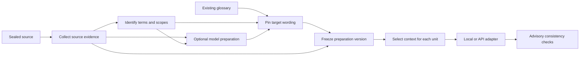

# Document context and terminology consistency

Status: implemented delivery specification (2026-09-27). The initial source baseline is
`0ced919cccc3d672d57518e804f4932b150257d6`. This document distinguishes the delivery
scope below from the [option catalogue](translation-consistency-options.md).
It does not claim that every research option is installed or benchmarked.

## Problem and outcome

Paragraph translation can interpret the same concept differently and choose
different target words across a paper. Each translation request should share a
stable understanding of the paper and its terminology while retaining existing
block IDs, protected references, editing, recovery and publication behavior.

The preparation pipeline separates three questions:

1. **Context collection:** what does the uploaded paper actually say?
2. **Term identification:** which expressions name concepts, and in which scope?
3. **Target wording:** how should each concept be expressed in this locale?

Summary generation is optional. An extractive brief containing author statements
and definitions is useful without a generative model. Candidate extraction alone
does not establish meaning or a correct bilingual glossary.

## Modular architecture

| Module | Input | Output / responsibility |
| --- | --- | --- |
| Collection | Sealed source revision | Source excerpts, headings, abstract, contributions, conclusion, definitions, notation and coverage notes |
| Identification | Source evidence | Ranked concept candidates with original spellings, aliases, occurrences and section scope |
| Optional enrichment | Verified paper identity; explicitly selected source | External abstract or TLDR with origin/version; never replacement source text |
| Optional analysis | Bounded evidence and candidates | Grounded brief and target-wording suggestions; no human-review claim |
| Wording | Candidates, locale, frozen existing glossary, model suggestions | Preferred equivalents and unresolved/conflicting choices |
| Context selection | Frozen preparation plus one translation unit | Compact paper brief and only applicable definitions/terms |
| Provider adapter | Shared context contract | Protocol/model-native request; only requested unit becomes translation output |
| Consistency checks | Source, output and the actual frozen terms | Nonblocking missing/preferred/forbidden-term findings |

Use ordinary Python contracts and version constants for these modules. A plugin
framework, vector database and second orchestration engine are unnecessary.

## Delivery scope and defaults

The first delivery includes deterministic collection and term extraction,
versioned paper preparation, relevant-term selection, optional preparation using
the explicitly selected translation provider, local/API context adapters,
inspectable preparation, advisory terminology checks, and one separately selected
small local analyst through Docker Model Runner. No extra provider is chosen
automatically. Additional analyst models and external retrieval connectors remain
explicit integrations with the acceptance conditions in the catalogue.

Provide four per-job modes:

- `off`: preserve the existing paragraph translation flow.
- `extractive`: prepare source evidence and existing terminology without extra
  model calls; the normal default for new translation requests.
- `provider`: additionally request bounded preparation from the selected API provider.
  Show that preparation adds requests/cost before submission. If a model adapter
  only supports translation, select the separate analyst explicitly instead of
  pretending the translator can generate a scientific summary.
- `local`: run the pinned small local analyst before either API or local
  translation. Freeze its separate model identity and account for its requests
  independently. Model preparation/use may download its pinned weights; viewing
  settings or preparation results never downloads them.

Existing frozen jobs lacking the option retain their old behavior. Upload,
saved-parse confirmation, edition translation, continuation and candidate
translation must carry the same explicit choice. Review remains a separate task.

## Source evidence contract

Every excerpt has an ID, source block ID, exact quote, role and source hash.
Extraction scans the whole available parsed source; selected context is bounded
and reports what was omitted. Reading all parsed blocks is not a claim that the
parser recovered every PDF region, or that an LLM saw the whole paper.

Include useful prose from the abstract, contribution statements, section map,
conclusion, explicit definitions, acronym expansions, captions and table headers.
Do not reinterpret numeric expressions or mathematical notation. Exclude
original-only authors, affiliations, identifiers, references and other retained
metadata. Source text is untrusted data, never model instructions.

Evidence existence and exact-quote validation are mechanical checks. They do not
prove that a generated interpretation follows from its citations. Generated
claims remain labeled model suggestions, and exact source excerpts stay available.

## Concepts and target wording

A concept contains a stable ID, source spelling, aliases, definition evidence,
occurrences, scope, extraction method and optional target proposal. A target
proposal records spelling, origin and review status; locale is bound by the pack.
Explicit glossary entries also support accepted variants. IDs include
scope/evidence so identical strings can represent distinct senses. For example,
MPI `rank` and matrix `rank` must not become one mandatory replacement rule.

Meaning follows the paper's definition and local usage. Target-wording precedence
is explicit document choice, existing reviewed terminology for the same sense and
locale, author-provided bilingual wording, authoritative terminology, trusted
parallel literature, then model/community suggestions. Conflicts remain visible;
frequency and model confidence are not correctness evidence.

The existing flat global/document glossary remains compatible. Its explicit
entries take precedence. Store scoped automatic concepts separately inside the
preparation and project only applicable entries into a request. Never insert
automatic guesses into the global glossary or label them human-reviewed. Do not
infer bilingual term alignment from arbitrary reviewed sentences. Translation
memory can supply evidence only when the term alignment itself is known.

Generated entries are preferred wording, not mandatory global substitution.
Ambiguous candidates may remain unresolved. Manual glossary editing stays
optional, and no content-quality finding blocks translation or publication.

## Frozen state, storage and lifecycle

Use existing job/task JSON for the immutable preparation snapshot and its model
attempts. A draft can hold the final snapshot in its profile metadata; derived
metadata must be excluded from provider-configuration identity comparisons.
No change to installed migrations or immutable published IR is required merely
to retain this internal preparation data.

Bind the preparation digest to source content/revision, target locale, algorithm
versions, selected options, existing glossary revision/entries, model request
identity and accepted results. Source-only collection has its own digest so it
can later be cached independently of target language. A glossary/source change
creates a new preparation; running tasks continue with their original snapshot.

Record the preparation digest and actual request terms in segment provenance.
Context and terminology changes must change the translation cache identity.
Preserve inherited segment provenance during continuation, edits and candidate
acceptance; never relabel old translations as using newly generated terms.
Snapshots already sealed or published stay unchanged.

Preparation happens before translation fan-out. A model request is its own
durable task/attempt under the existing job, permit, budget, lease and control
epoch. It is never a hidden HTTP call inside the planning transaction. Persist a
validated result checkpoint before content writes so recovery can reuse paid
results. Pause, cancellation, maintenance, source replacement and deletion fence
late content writes; accounting can still record late usage.

A malformed semantic suggestion may be discarded with a warning and the
extractive context retained. Configuration failures, exhausted budgets, stale
versions and uncertain network outcomes retain their existing execution states.
Do not silently retry unknown paid requests or switch providers to obtain a brief.

The implemented analyst is MiniCPM5-1B Q4 with a pinned MLX artifact. A job requests
one bounded analysis; it does not run a second content-repair request. Known
unsent/unexecuted transport failures retain the existing bounded retry policy.
No analysis runs when all requested translation units already exist. Extraction
currently retains up to 96 complete evidence passages and 48 ranked concepts;
analysis selects up to 24 candidates and accepts up to four summary items and
16 target proposals. English definition/acronym/frequency rules have limited
language coverage; exact source evidence and model analysis remain available for
other languages. This does not claim complete notation or sense extraction.

## Request packing and provider behavior

Keep paragraph-sized output units and their protected-reference contract. The
model may receive document context without having to output the entire paper.
Larger coherent translation batches are a separate option, not a prerequisite.

Pack context deterministically: applicable explicit glossary, relevant concept
definitions, brief, section heading, then optional neighboring evidence. Budget
the serialized request, template overhead and reserved output together. Trim
optional evidence before sacrificing the requested source or protected atoms.
Do not turn a formerly valid source unit into a permanent failure just because
the whole glossary or brief was appended. Record omitted context and unresolved
terms; never describe a truncated excerpt pack as the entire paper.

API adapters share the information contract and strict response validation. Local
adapters use their model's native prompt. The existing local omission of adjacent
prose is a regression defense against translating the background itself. Richer
context must therefore be explicit, bounded and tested; do not remove legacy
behavior for old jobs. An adapter without background support still receives
applicable terminology and reports the limitation.

Model-advertised context is not the configured runtime context. Current local
catalogue entries allocate 8,192 tokens; context and output compete for that
window. UTF-8 byte ceilings are conservative application guards, not measured
token counts. Record usage from actual provider responses when available.

## External context policy

Crossref/arXiv material is only eligible after paper/version matching. Compare
retrieved abstracts with local extracted abstract after harmless markup and
whitespace normalization. Equal abstracts add nothing. A difference must be
classified as extra information, parsing discrepancy, another version or conflict;
difference alone is insufficient to include it. Preserve numbers and negation.

Semantic Scholar TLDR is supplementary generated context, not author text. Record
its provenance and allow absence. Identifier-only metadata lookup does not
authorize uploading the PDF/body to an analysis service. Each connector must
respect explicit configuration, bounded requests, response limits and API terms.

## User experience

The translation form explains the selected preparation mode and any extra model
requests. Existing destination/egress and optional monetary controls apply.
The draft exposes collected context, terms, scope, origin and unresolved choices
without requiring review. Users can use existing glossary controls to pin wording
and create a new translation/candidate run. Show preparation progress alongside
translation progress. Internal hashes are evidence metadata, not required steps
in the ordinary user flow.

Draft baseline, selected segment and candidate preparation have separate views.
An off-mode replacement has no preparation even if its draft baseline does. Copies
and human edits retain the preparation job reference of their originating segment.

## Acceptance

- Repeated concepts receive the same applicable preferred wording; a same-spelled
  concept in another section can retain a different sense.
- Model input contains bounded grounded paper context for supported adapters;
  only the selected unit appears in translated output.
- Protected atoms, source bytes, paragraph ownership and output bijection survive
  preparation and translation unchanged.
- No extra model call occurs in extractive mode. Model mode obeys the selected
  profile, consent, budget and unknown-outcome rules.
- Preparation is inspectable, frozen, reproducible, source-bound and never a
  fabricated human review. Deletion and stale workers cannot resurrect it.
- Old jobs, flat glossaries, continuation, candidates and immutable publication
  remain compatible. Term findings remain nonblocking.
- Unit, PostgreSQL integration, API and rendered-browser tests cover the above.
  Test doubles establish contracts, not live model quality or MLX compatibility.
  Real-model evaluation is a separate explicitly budgeted/content-authorized run.

See the [implementation plan](2026-09-26-translation-consistency.md) for tasks and
the [option catalogue](translation-consistency-options.md) for alternatives and
runtime-cost assumptions.
